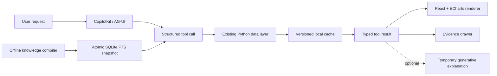

# Agent UI Architecture

## Scope

`apps/agent-ui/` is an experimental, network-capable companion to the stable
offline exhibits in `output/29_*.html` through `output/38_*.html`. It does not
replace those pages and is not part of their navigation or build contract.

The application has two runtime layers:

1. `agent/`: CopilotKit and AG-UI orchestration, evidence lookup, cache refresh,
   and six structured tools.
2. `web/`: React UI, CopilotKit chat surface, ECharts views, playback controls,
   and optional temporary generative explanations.

An offline compiler creates a versioned SQLite FTS5 poetry knowledge snapshot.
FastAPI and Next.js open it read-only; request-time search never waits for a
model and never mutates the corpus.

The current full snapshot contains 20,437 works and 143,842 stable line units.
One- and two-character Chinese queries use dedicated B-tree token maps; longer
queries use trigram FTS5. Optional LLM enrichment is an offline, checkpointed
batch with a bounded 1..64 worker pool (CLI default 64), never a request-time
dependency.

## Data Authority

The model is an orchestrator, not a historical database. Tool responses must be
derived from project data generated by the existing Python pipeline:

- `data/reviewed/poet_journeys.json`
- `data/reviewed/verified_poem_contexts.csv`
- `data/candidates/*_spirit_chronology.csv`
- `data/poems.json`
- deterministic visualization aggregates under `output/assets/competition/`
- `output/assets/knowledge/poetry_knowledge.sqlite3` and its manifest

Candidate chronology remains visibly marked as candidate or inferred. Missing
coordinates, unresolved dates, and grade-D records are returned as evidence
gaps rather than filled by the language model.

Knowledge analysis has an equally explicit boundary: local dictionary and
emotion results use `method=rules`; optional batch enrichment uses
`method=llm`. Model candidates store their model, prompt/input hashes,
confidence, review state, and job status, and never overwrite rule evidence.

## Tools

### `generate_poet_route`

Returns a time-ordered route assembled from reviewed journey stops and eligible
chronology records. The response includes source metadata, evidence grade,
coordinate provenance, and an explicit insufficiency state. Poetry place names
are not treated as travel history.

The factual boundary is explicit: `routeSegments` contains only strict
chronology edges, while `visualTransitions` contains coordinate-complete gaps
between adjacent scenes. Every visual transition is marked
`historical_claim: false` and `certainty: not_asserted`; it connects camera
positions only and asserts neither a road, a transport mode, nor travel speed.
The React player resolves both arrays into curved playback legs, but renders
them with different line styles and labels.

### `play_poem_scenes`

Returns ordered playback scenes for a selected poet or poem set. Each scene is
bound to a poem record, date range, location when available, evidence label,
source, and optional image prompt. The client owns pause/next/replay timing.

### `compare_imagery`

Returns deterministic imagery counts, rates, evidence lines, exclusions, and
sample-size notes. The client renders comparisons with ECharts; prose generated
by the model cannot overwrite the numeric payload.

### `search_poetry_knowledge`

Searches poems and exact line units with composable poet, dynasty, imagery and
emotion filters. Results carry stable `poemId`/`lineId` values for reuse by
other pages without parsing generated prose.

### `get_poem_knowledge` / `get_line_knowledge`

Return original text, exact offsets, ordered analyses and provenance for a
stable ID. Missing or stale snapshots return rebuild guidance instead of an
online model fallback.

## Vector Retrieval Sidecar

Semantic retrieval is an optional sidecar to the canonical SQLite snapshot. The
20,437-poem/143,842-line database is never rewritten by vector generation. The
sidecar reuses `poem_id`, `line_id`, `body_hash`, and `line_hash`, and stores
canonical embedding inputs with an explicit `textVersion`:

```text
output/assets/knowledge/embeddings/<model-slug>/<build-id>/
  items.sqlite3
  poems.f32
  lines.f32
  manifest.json
output/assets/knowledge/embeddings/current.json
```

The builder writes a hidden `.building` directory, commits one batch checkpoint
at a time, and atomically replaces `current.json` only after all requested
items are complete. It allows at most `2 * concurrency` provider requests in
flight and accepts a CLI concurrency range of `1..64`; the checked-in default
is eight because SiliconFlow account RPM/QPS limits are account-specific. A
failed run keeps its checkpoint and can be resumed with the same command. A
`--allow-partial` artifact is marked `status=partial` and is never activated by
the query repository.

The provider contract is OpenAI-compatible:

```http
POST https://api.siliconflow.cn/v1/embeddings
Authorization: Bearer <AGENT_EMBEDDING_API_KEY>
Content-Type: application/json
```

```json
{
  "model": "BAAI/bge-m3",
  "input": ["文本1", "文本2"],
  "encoding_format": "float"
}
```

The client reorders response entries by `data[].index`, checks count,
dimension, finite values and non-zero norm, then stores little-endian float32
L2-normalized vectors. Query-time cosine search uses NumPy `memmap` when
available and a bounded pure-Python fallback otherwise. The manifest records
the provider, model, observed dimension, metric, text template, source
knowledge `buildId`/`databaseSha256`/`sourceHashes`, row counts, request usage,
artifact status, and SHA-256 for every file. Activation also verifies the
actual knowledge database hash and the metadata SQLite schema/index range.

`GET /knowledge/search` and `search_poetry_knowledge` retain the legacy
lexical contract and add `mode=lexical|semantic|hybrid`. Semantic and hybrid
requests generate only the query vector; poems and lines remain read-only
facts from the local snapshot. Hybrid ranking uses reciprocal rank fusion and
reports `totalRelation=gte` when its bounded candidate pool is approximate.
The service falls back to lexical search on a missing/stale sidecar or a
provider/network failure and marks the response with `degraded` and a reason.

The browser can see index readiness and model metadata, but never receives the
API key. Configure the provider only through `AGENT_EMBEDDING_*` environment
variables; these settings are intentionally independent from `AGENT_LLM_*`.
No production vector artifact is checked in until a SiliconFlow key is
provided. For large exact searches, install the optional dependency with
`pip install -e "apps/agent-ui/agent[vectors]"`.

## Event Flow



The cache is refreshed when its source fingerprint changes and is replaced
atomically. This keeps the web process read-only with respect to the historical
source files while avoiding stale data after a deterministic rebuild.

## Generative UI Boundary

OpenGenerativeUI is opt-in and disabled by default. It may produce temporary
SVGs, diagrams, and explanatory controls from an already returned tool payload.
It cannot create, edit, rank, or suppress historical route nodes or evidence.

## Community Components

Selected Uiverse Galaxy styles are limited to toggles, loaders, and playback
controls. They do not define the application layout or data visualization
language. See [THIRD_PARTY_NOTICES.md](THIRD_PARTY_NOTICES.md).
